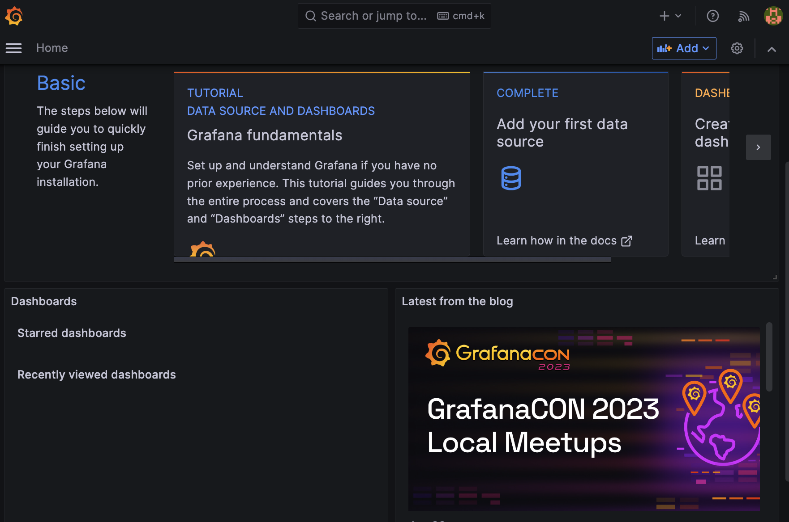
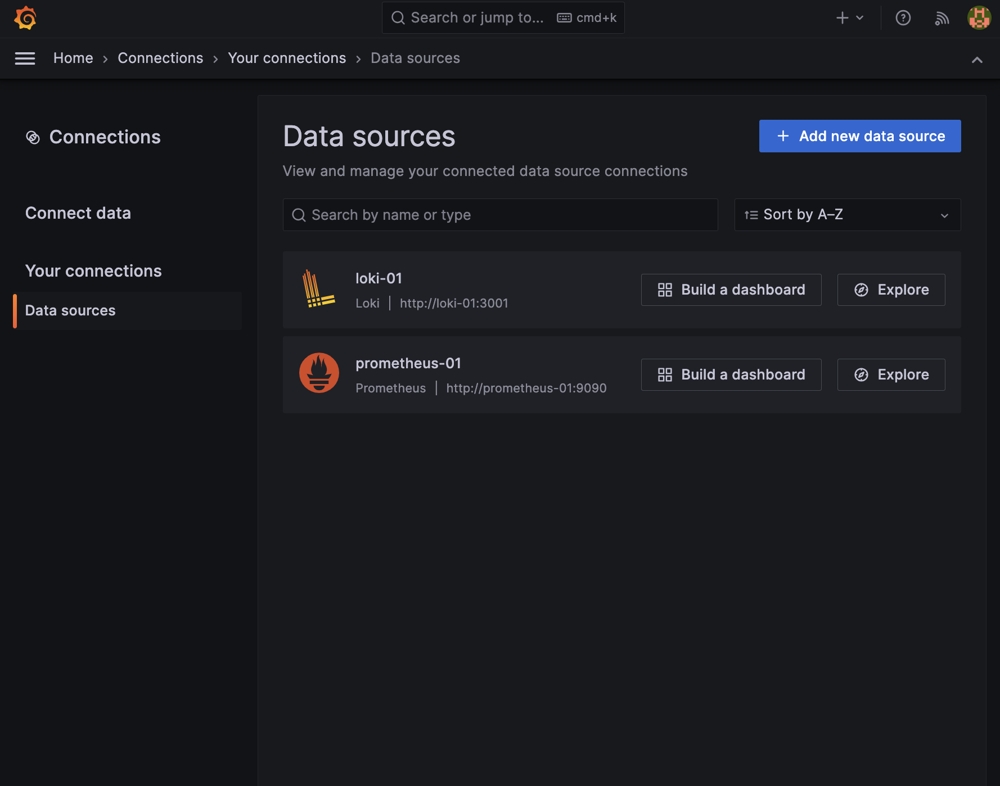
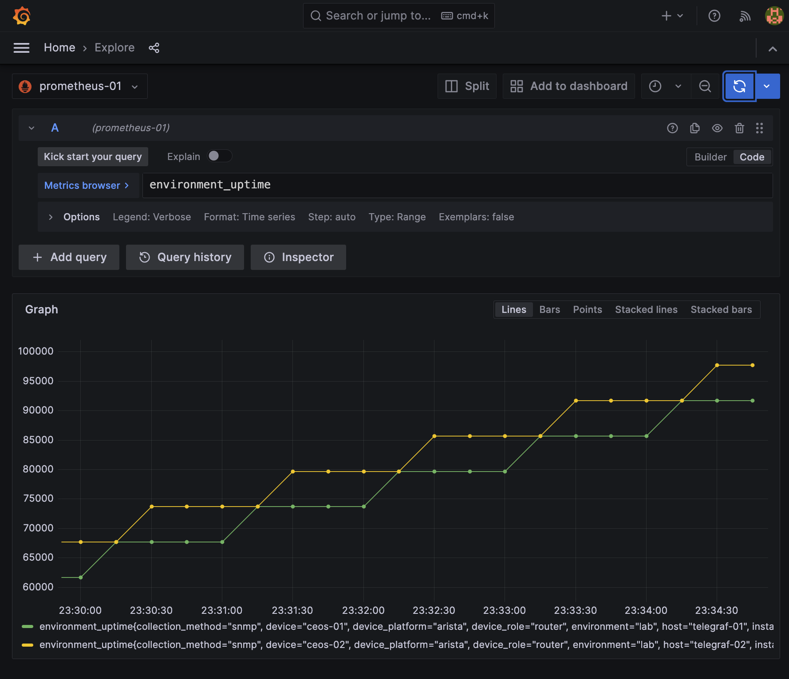
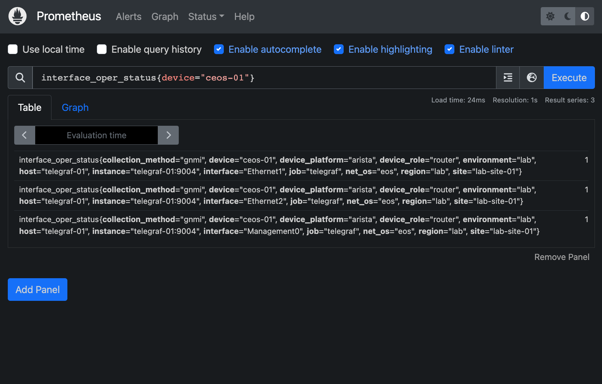
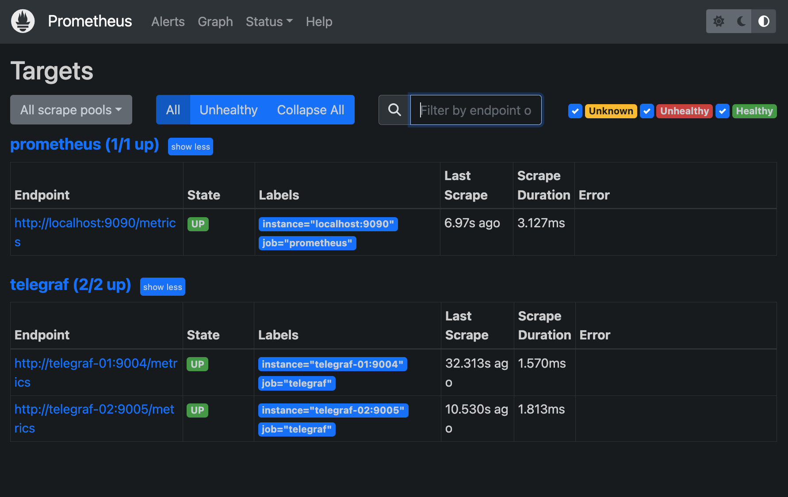
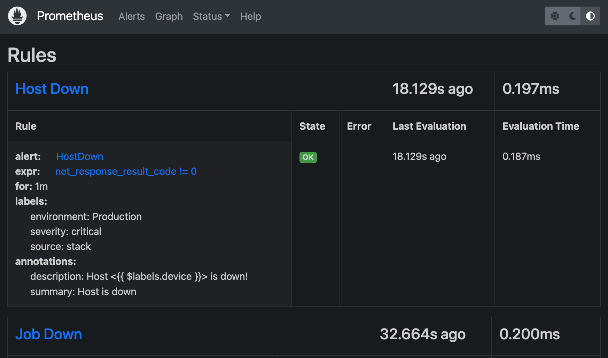

# Network Observability Lab

This repository serves as a valuable resource for constructing and managing an Observability stack within a network lab.

## Requirements

To run the components of the Observability stack and network devices you must have:

- `docker` and compose installed in your system
- `containerlab` for the network lab
- `netobs` (optional) for managing the network lab and observability stack

### Quickstart

To get started with the network lab and observability stack, you can run the following commands:

```bash
# Setup environment variables (edit the .env file to your liking)
cp example.env .env

# Install the python dependencies
pip install .

# Start the network lab
netobs lab deploy
```

`netobs` is a utility tool that provides functions to interact and manage the network lab and observability stack in the repository. It is designed to simplify the process of managing and monitoring network infrastructure by providing a set of helpful commands and utilities.

Alternatively, you can run the following commands to start the network lab and observability stack:

```bash
# Start the containerlab
containerlab deploy -t ./containerlab/lab.yml

# Start the observability stack
docker-compose -f ./obs_stack/docker-compose.yml up -d --remove-orphans
```

---

### Examples of `netobs` commands

Deploy the network lab and observability stack:

```bash
# Start the network lab
❯ netobs lab deploy batteries-included --sudo
[21:50:42] Deploying lab environment
           Network create: network-observability
           Running command: docker network create --driver=bridge  --subnet=198.51.100.0/24 network-observability
9b4f25c69a21796cd563e09fba341087f0a4b8c4e38872b0ed701e61d3d3f2c8
           Successfully ran: network create
─────────────────────────────────────────────────── End of task: network create ────────────────────────────────────────────────────

           Deploying containerlab topology
           Topology file: containerlab/lab.yml
           Running command: sudo containerlab deploy -t containerlab/lab.yml
INFO[0000] Containerlab v0.36.1 started
INFO[0000] Parsing & checking topology file: lab.yml
INFO[0000] Creating lab directory: /home/netpanda/projects/network-observability/modern-network-observability-lab/clab-lab
INFO[0000] Creating container: "ceos-01"
INFO[0000] Creating container: "ceos-02"
INFO[0001] Creating virtual wire: ceos-01:eth2 <--> ceos-02:eth2
INFO[0001] Creating virtual wire: ceos-01:eth1 <--> ceos-02:eth1
INFO[0001] Running postdeploy actions for Arista cEOS 'ceos-02' node
INFO[0001] Running postdeploy actions for Arista cEOS 'ceos-01' node
INFO[0031] Adding containerlab host entries to /etc/hosts file
INFO[0031] 🎉 New containerlab version 0.41.2 is available! Release notes: https://containerlab.dev/rn/0.41/#0412
Run 'containerlab version upgrade' to upgrade or go check other installation options at https://containerlab.dev/install/
+---+---------+--------------+----------------+------+---------+------------------+--------------+
| # |  Name   | Container ID |     Image      | Kind |  State  |   IPv4 Address   | IPv6 Address |
+---+---------+--------------+----------------+------+---------+------------------+--------------+
| 1 | ceos-01 | d59629fbbdc0 | ceos:4.28.5.1M | ceos | running | 198.51.100.11/24 | N/A          |
| 2 | ceos-02 | 80854bfd7e08 | ceos:4.28.5.1M | ceos | running | 198.51.100.12/24 | N/A          |
+---+---------+--------------+----------------+------+---------+------------------+--------------+
[21:51:14] Successfully ran: Deploying containerlab topology
─────────────────────────────────────────── End of task: Deploying containerlab topology ───────────────────────────────────────────

           Starting service(s): None
           Running command: docker compose --project-name netobs -f obs_stack/docker-compose.yml --verbose up -d --remove-orphans
[+] Building 0.0s (0/0)
[+] Running 10/10
 ✔ Volume "netobs_grafana-01_data"     Created                                                                                 0.0s
 ✔ Volume "netobs_loki-01_data"        Created                                                                                 0.0s
 ✔ Volume "netobs_prometheus-01_data"  Created                                                                                 0.0s
 ✔ Container netobs-grafana-01-1       Started                                                                                 0.7s
 ✔ Container netobs-logstash-01-1      Started                                                                                 1.2s
 ✔ Container netobs-loki-01-1          Started                                                                                 1.1s
 ✔ Container netobs-prometheus-01-1    Started                                                                                 1.3s
 ✔ Container netobs-alertmanager-01-1  Started                                                                                 0.8s
 ✔ Container netobs-telegraf-01-1      Started                                                                                 0.9s
 ✔ Container netobs-telegraf-02-1      Started                                                                                 1.0s
[21:51:16] Successfully ran: start stack
───────────────────────────────────────────────────── End of task: start stack ─────────────────────────────────────────────────────
```

Showing the logs of the `telegraf-01` container:

```bash
# Show the logs of the telegraf-01 container
❯ netobs docker logs telegraf-01 --tail 20
[21:54:21] Showing logs for service(s): ['telegraf-01']
           Running command: docker compose --project-name netobs -f obs_stack/docker-compose.yml logs --tail=20 telegraf-01
netobs-telegraf-01-1  | 2023-06-04T21:51:15Z I! Starting Telegraf 1.17.2
netobs-telegraf-01-1  | 2023-06-04T21:51:15Z I! Loaded inputs: gnmi internal net_response snmp
netobs-telegraf-01-1  | 2023-06-04T21:51:15Z I! Loaded aggregators:
netobs-telegraf-01-1  | 2023-06-04T21:51:15Z I! Loaded processors: enum (3x) rename (5x)
netobs-telegraf-01-1  | 2023-06-04T21:51:15Z I! Loaded outputs: prometheus_client
netobs-telegraf-01-1  | 2023-06-04T21:51:15Z I! Tags enabled: environment=lab host=telegraf-01
netobs-telegraf-01-1  | 2023-06-04T21:51:15Z I! [agent] Config: Interval:10s, Quiet:false, Hostname:"telegraf-01", Flush Interval:10s
netobs-telegraf-01-1  | 2023-06-04T21:51:15Z I! [outputs.prometheus_client] Listening on http://[::]:9004/metrics
           Successfully ran: show logs
────────────────────────────────────────────────────── End of task: show logs ──────────────────────────────────────────────────────
```

---

### Grafana Access

To access Grafana, you can use the following credentials:

- Username: `netobs`
- Password: `netobs123`

Now you can access Grafana at `http://<host_ip>:3000`

<p float="left">
  
</p>
<p float="left">
  
  
</p>

---

### Prometheus Access

To access Prometheus at `http://<host_ip>:9090`

<p float="left">
  
</p>
<p float="left">
  
  
</p>
