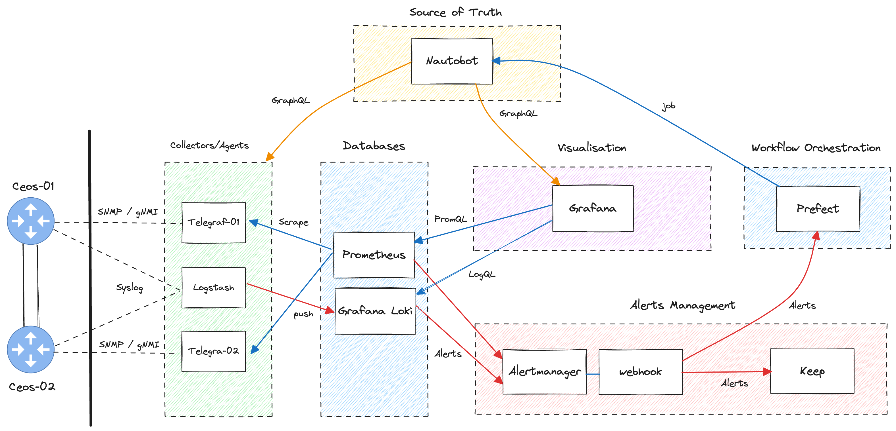
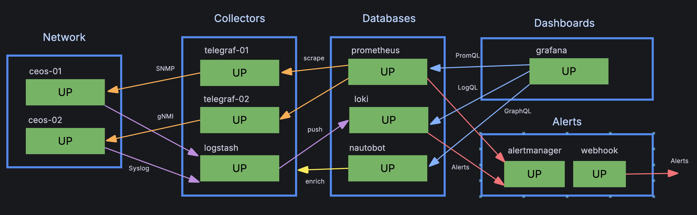
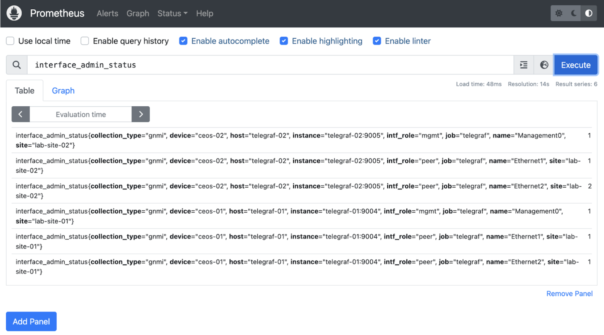
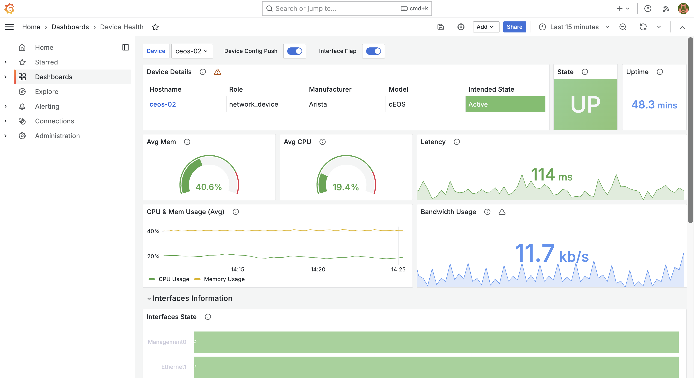
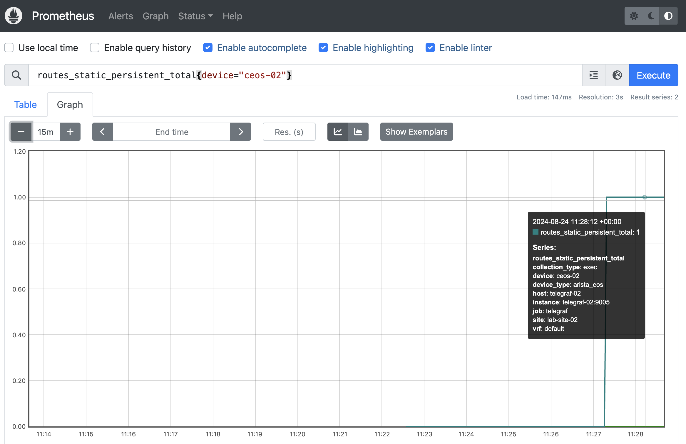
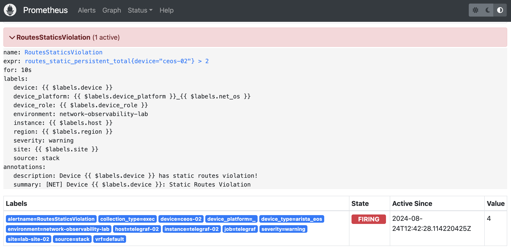
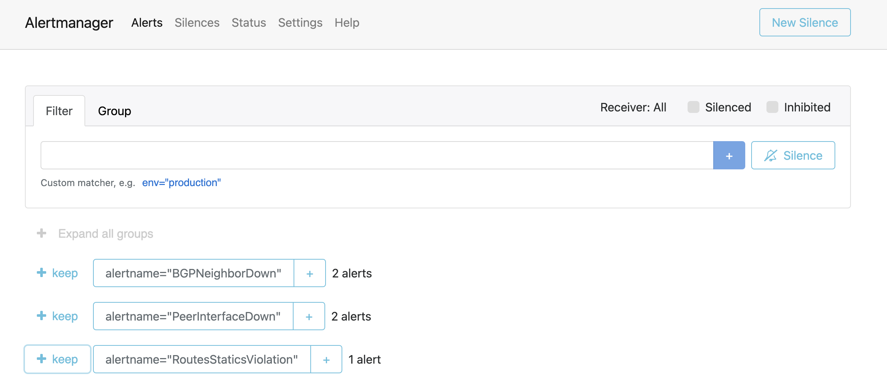
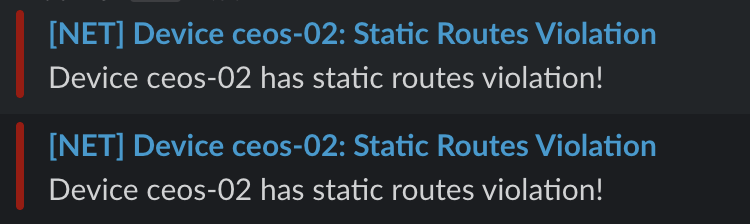

# Batteries Included Scenario

The goal of this lab scenario is to showcase a comprehensive observability stack using open-source tools. It integrates most of the configurations and system designs provided in the chapters of the book, offering a practical, hands-on environment to explore these tools in action.

- [Batteries Included Scenario](#batteries-included-scenario)
  - [High-Level Overview](#high-level-overview)
    - [Checking the Lab Environment](#checking-the-lab-environment)
  - [Component Overview and Interaction Guide](#component-overview-and-interaction-guide)
    - [Network Devices (`cEOS`)](#network-devices-ceos)
      - [Checking the Containerlab Topology](#checking-the-containerlab-topology)
      - [Logging into the Devices](#logging-into-the-devices)
      - [Commands to Interact with the Devices](#commands-to-interact-with-the-devices)
    - [Nautobot](#nautobot)
    - [Verifying and Populating Nautobot](#verifying-and-populating-nautobot)
      - [Accessing Nautobot](#accessing-nautobot)
      - [Enriching Data](#enriching-data)
    - [Telegraf](#telegraf)
      - [Checking Telegraf Logs](#checking-telegraf-logs)
      - [Viewing Prometheus Metrics](#viewing-prometheus-metrics)
      - [Running Network Commands from Inside the Telegraf Container](#running-network-commands-from-inside-the-telegraf-container)
      - [Verifying Metrics Scraping in Prometheus](#verifying-metrics-scraping-in-prometheus)
    - [Logstash](#logstash)
      - [Checking Logstash Logs](#checking-logstash-logs)
      - [Verifying Log Ingestion in Loki](#verifying-log-ingestion-in-loki)
    - [Prometheus](#prometheus)
      - [Checking Prometheus Status](#checking-prometheus-status)
      - [Querying Metrics with PromQL](#querying-metrics-with-promql)
    - [Grafana](#grafana)
      - [Accessing Grafana](#accessing-grafana)
      - [Creating a Custom Dashboard](#creating-a-custom-dashboard)
    - [Alertmanager](#alertmanager)
      - [Checking Alertmanager Status](#checking-alertmanager-status)
  - [Working with the Lab](#working-with-the-lab)
    - [Collecting Data](#collecting-data)
    - [Querying Data](#querying-data)
    - [Creating and Managing Alerts](#creating-and-managing-alerts)
      - [Triggering and Monitoring Alerts](#triggering-and-monitoring-alerts)

## High-Level Overview

The following diagram illustrates the topology of the lab environment:



**IMPORTANT!:** If you have followed the tutorial for setting up the [VM hosting the lab environment in DigitalOcean](./../../setup/README.md), the `batteries-included` scenario should be up and running. If not, we recommend completing the tutorial to set up the environment.

> **Note:** The environment does not have to be hosted on a DigitalOcean VM/Droplet exclusively. The tutorial is also applicable to any Debian-based Linux system. Additionally, you can run the environment in GitHub Codespaces—see the general [README](./../../README.md) for more information.

### Checking the Lab Environment

To check if the lab environment is running, use the following command:

```bash
netobs lab show
```

This command will display all the containers and Containerlab devices currently running. If none are listed, you can start the environment with:

```bash
netobs lab prepare --scenario batteries-included
```

---

## Component Overview and Interaction Guide

The following are sections for each components describing their role and how to interact with them. An important thing to highlight is that you will need to get the necessary credentials for the lab environment stored in your `.env` file. When in search of the credentials look there.

### Network Devices (`cEOS`)

The `cEOS` devices (`cEOS-01` and `cEOS-02`) are simulated network routers running in Containerlab. These devices generate metrics and logs, which are collected by the observability stack. They serve as the data sources for the lab, mimicking real-world network equipment.

#### Checking the Containerlab Topology

To view the current network topology and ensure the devices are running, use the following command:

```bash
netobs containerlab inspect

# If sudo mode is needed
netobs containerlab inspect --sudo
```

This will display a detailed overview of the Containerlab environment, including the status of the `cEOS` devices.

If is giving you an error about permissions, you might need to run the command in `sudo` mode, by either passing the command line flag or setting the environment variable `LAB_SUDO=true` in your `.env` file.

#### Logging into the Devices

You can log into the `cEOS` devices using SSH to perform network operations, such as shutting down interfaces or viewing configuration details:

```bash
# Example connecting to ceos-02 using the default netobs credentials
ssh netobs@ceos-02
```

Once logged in, you can execute standard network commands. For example, to shut down an interface:

```bash
configure
interface Ethernet2
no shutdown
```

This command shuts down the `Ethernet2` interface, which will trigger alerts and logs that can be observed through the observability stack.

#### Commands to Interact with the Devices

Here are some useful commands to interact with the `cEOS` devices:

- **Check Interface Status:**

  ```bash
  show interfaces status
  ```

- **View Logs:**

  ```bash
  show logging
  ```

- **Ping Test:** Useful to generate some lightweight traffic and check it on the dashboards

  ```bash
  ping <destination_ip> size 1400
  ```

### Nautobot

Nautobot acts as the source of truth for the network. It enriches data collected by Telegraf and Logstash with additional context, such as device metadata or topology information.

### Verifying and Populating Nautobot

Before populating Nautobot with data from your network devices, ensure that the Nautobot service is fully operational. Here are three methods to verify its readiness:

1. **Check the `nautobot` Service Health:**
   Run the following command to check the status of the `nautobot` service:

   ```bash
   netobs lab show | grep nautobot
   ```

   If the service is still starting, you will see a message indicating its health status as `(health: starting)`. For example:

   ```shell
   ❯ netobs lab show | grep nautobot
   nautobot            docker.io/networktocode/nautobot:2.2-py3.10    "/docker-entrypoint.…"   nautobot            About a minute ago   Up About a minute (health: starting)   0.0.0.0:8080->8080/tcp, :::8080->8080/tcp, 0.0.0.0:8443->8443/tcp, :::8443->8443/tcp
   ```

2. **Monitor the Meta Monitoring Dashboard:**
   The Meta Monitoring dashboard in Grafana provides an overview of the
   health of your services. Access it via `http://<lab-machine-address>:3000/dashboards`.

   If Nautobot is still starting, the dashboard will reflect this status. Here is an example of what you might see:
   

3. **Review the `nautobot` Logs:**
   You can follow the logs of the Nautobot container to monitor its startup process. Use the command:

   ```bash
   netobs docker logs nautobot --tail 10 --follow
   ```

   Wait until you see the message `Nautobot initialized!`, which confirms that Nautobot is ready for use.

Once Nautobot is ready, you can populate it with data from your network devices by running the following command:

```bash
netobs utils load-nautobot
```

This command will load the necessary data into Nautobot, making it fully operational and ready for use with the other components in your observability stack.

#### Accessing Nautobot

You can access Nautobot via its web interface:

```
http://<lab-machine-address>:8080
```

Login to explore network device inventories, view relationships, and check the data being fed into Grafana.

#### Enriching Data

Nautobot can be queried using its GraphQL API. For example, to enrich device data in Grafana:

```graphql
{
  devices {
    name
    site {
      name
    }
  }
}
```

This query will return device names and their corresponding sites, which can then be used to add context to your Grafana visualizations, enhancing the insights you can derive from your observability data.

### Telegraf

Telegraf is an agent used for collecting and reporting metrics. In this lab, Telegraf is configured to collect metrics from `cEOS` devices using SNMP, gNMI and SSH protocols, which it then forwards to Prometheus. The data collected from the different methods is normalized for easier dashboarding and creation of alerts.

It also performs synthetic monitoring on the devices and services of the stach using `ping` and `HTTP` probes against them.

#### Checking Telegraf Logs

To ensure that Telegraf is running correctly and collecting metrics, you can check its logs with the following command:

```bash
netobs docker logs telegraf-01 --tail 20 --follow
```

This will display real-time logs from Telegraf, helping you verify that it is successfully scraping metrics from the `cEOS` devices.

#### Viewing Prometheus Metrics

Telegraf exposes metrics that can be scraped by Prometheus. To view these metrics directly, you can see them in your browser by going to the URL `http://<lab-machine-address>:<prometheus-port>/metrics`:

```bash
# Telegraf-01 metrics endpoint
http://<lab-machine-address>:9004/metrics

# Telegraf-02 metrics endpoint
http://<lab-machine-address>:9005/metrics
```

You can check the status of the Telegraf targets and the metrics being collected by looking into Prometheus web interface `http://<lab-machine-address>:9090/targets`.

#### Running Network Commands from Inside the Telegraf Container

You may need to troubleshoot or run network commands from within the Telegraf container. To do this, use the following command:

```bash
netobs docker exec telegraf-01 sh
```

Once inside the container, you can run network commands like `ping` to test connectivity:

```bash
ping ceos-01
```

Or even open a Python terminal and run commands with [netmiko](https://github.com/ktbyers/netmiko)!.

```bash
# Open the python terminal
python
```

To test it you can use the following snippet.

```python
import netmiko
from rich.pretty import print as rprint

device = netmiko.ConnectHandler(host="ceos-02")

result = device.send_command("show version")

rprint(result)
```

#### Verifying Metrics Scraping in Prometheus

To view the Telegraf metrics scraped from Prometheus, you can access the Prometheus web interface in your browser. The URL will typically be something like:

```
http://<lab-machine-address>:9090/targets
```

Here, you can see the status of the Telegraf targets and the metrics being collected.

### Logstash

Logstash is a data processing pipeline that ingests logs from network devices and forwards them to Grafana Loki for centralized log storage and analysis. In this lab scenario, Logstash is configured to collect Syslog data from the `cEOS` devices, parse their messages with an emphasis on the interfaces `UPDOWN` events for alert generation.

#### Checking Logstash Logs

To verify that Logstash is running properly and processing logs, you can check its logs with the following command:

```bash
netobs docker logs logstash --tail 20 --follow
```

This command will display the real-time logs from Logstash, helping you ensure that it is correctly receiving by showing its output in a `rubydebug` format.

#### Verifying Log Ingestion in Loki

Once Logstash is confirmed to be running, you can verify that logs are being ingested into Grafana Loki. Access the Loki targets via the Grafana web interface:

```
http://<lab-machine-address>:3000/explore
```

In the **Explore** section, select **Loki** as the data source and use the following LogQL query to check for recent logs:

```logql
{collector="logstash"}
```

This query will display all logs processed by Logstash, allowing you to validate that the pipeline is functioning as expected.

### Prometheus

Prometheus is a time-series database used to scrape, store, and query metrics. In this lab, Prometheus collects metrics from Telegraf, allowing you to analyze network performance and trends.

#### Checking Prometheus Status

To check the status of Prometheus and its targets, you can visit the Prometheus web interface:

```
http://<lab-machine-address>:9090/targets
```

This page will show you all the active targets, including Telegraf, and whether Prometheus is successfully scraping them.

#### Querying Metrics with PromQL

PromQL is the query language used by Prometheus to retrieve metrics. You can access the Prometheus query interface through:

```
http://<lab-machine-address>:9090/graph
```



Example query to check network interface metrics:

```promql
rate(interface_in_octets{device="ceos-02"}[5m])
```

This query will show the rate of traffic flowing through interfaces, averaged over the last 5 minutes.

### Grafana

Grafana is the visualization layer of the observability stack. It is used to create dashboards that display metrics collected by Prometheus and logs from Loki.

#### Accessing Grafana

To access Grafana, open your web browser and go to:

```
http://<lab-machine-address>:3000
```

Login with the default credentials (usually `admin/admin`) and explore the pre-built dashboards. These dashboards are connected to Prometheus, Loki and Nautobot, providing real-time insights into network performance and events all with contextual information from Nautobot.



#### Creating a Custom Dashboard

To create a custom dashboard:

1. Click on **Create** > **Dashboard**.
2. Add a new panel, and select **Prometheus** as the data source.
3. Use PromQL to query specific metrics and visualize them.

For example, you could create a panel to show CPU usage across your `cEOS` devices.

### Alertmanager

Alertmanager is responsible for managing alerts generated by Prometheus. It routes these alerts to various destinations based on predefined rules.

#### Checking Alertmanager Status

You can check the status and configuration of Alertmanager by accessing:

```
http://<alertmanager_ip>:9093
```

This interface allows you to view active alerts, silence them, or check the routing rules.

---

## Working with the Lab

In this lab, we'll perform a task that utilizes several commands to help you understand how to interact with the lab environment. To make it interesting let's imagine the following scenario:

* **Problem:** The router `ceos-02` has strict configuration policies that allow a maximum of two static routes to be configured, only when necessary. If this threshold is exceeded, the network team should be alerted.
* **Solution:** The command `show ip route summary` provides a clear table in the CLI, showing the number of routes based on their source. By capturing and parsing this data, we can create metrics to set up a `warning` alert for the network team and develop a dashboard to display route counts over time.

### Collecting Data

We'll begin with data collection using Telegraf to gather route count metrics. While protocols like SNMP could be used, the SSH CLI output offers a sufficient amount of information. In this lab, we aim to demonstrate how to configure Telegraf instances with Python scripts for data collection.

First, let's test collecting data via SSH CLI and parsing it with a Python script.

1. **Connect to `telegraf-01`:**

   ```bash
   netobs docker exec telegraf-01 bash
   ```

2. **Enter the Python interpreter:**

   ```bash
   python
   ```

3. **Set up the necessary imports, configure device details, and check the command output:**

   ```python
   import os
   import netmiko
   from rich import print as rprint

   device = netmiko.ConnectHandler(
       device_type="arista_eos",
       host="ceos-02",
       username=os.getenv("NETWORK_AGENT_USER"),
       password=os.getenv("NETWORK_AGENT_PASSWORD")
   )

   result = device.send_command("show ip route summary")
   rprint(result)
   ```

4. **Parse the Output with TTP:**

   Next, we'll use TTP (TextFSM Template Processor) to parse the output. This template will extract relevant information from the command's output.

   ```python
   ttp_template = """
   <group name="info">
   Operating routing protocol model: {{ protocol_model }}
   Configured routing protocol model: {{ config_protocol_model }}
   VRF: {{ vrf }}
   </group>

   <group name="routes*">
      connected                                                  {{ connected_total | DIGIT }}
      static (persistent)                                        {{ static_persistent_total | DIGIT }}
      static (non-persistent)                                    {{ static_non_persistent_total | DIGIT }}
   </group>
   """

   route_summary = device.send_command("show ip route summary", use_ttp=True, ttp_template=ttp_template)
   rprint(route_summary)
   # Output
   # [
   #     [
   #         {
   #             'info': {'vrf': 'default', 'config_protocol_model': 'multi-agent', 'protocol_model': 'multi-agent'},
   #             'routes': [
   #                 {'static_non_persistent_total': '0', 'static_persistent_total': '0', 'connected_total': '2'}
   #             ]
   #         }
   #     ]
   # ]
   ```

5. **Generate an Influx Line Protocol Message:**

   With the parsed data, we'll now format it into an Influx Line Protocol message for Telegraf to process. Open the [`telegraf/routing_collector.py`](./telegraf/routing_collector.py) file and copy the `InfluxMetric` class, including its necessary imports, into your terminal.

6. **Format the Collected Metric:**

   Format the parsed data into the Influx Line Protocol format as follows:

   ```python
   measurement = "routes"
   tags = {
       "device": "ceos-02",
       "device_type": "arista_eos",
       "vrf": route_summary[0][0]["info"]["vrf"]
   }
   fields = {
       "connected_total": route_summary[0][0]["routes"][0]["connected_total"],
       "static_non_persistent_total": route_summary[0][0]["routes"][0]["static_non_persistent_total"],
       "static_persistent_total": route_summary[0][0]["routes"][0]["static_persistent_total"],
   }

   metric = InfluxMetric(measurement=measurement, tags=tags, fields=fields)
   print(metric)
   # Output
   # routes,device=ceos-02,device_type=arista_eos,vrf=default connected_total="2",static_non_persistent_total="0",static_persistent_total="4"
   ```

7. **Add the Logic to `routing_collector.py`:**

   Now, integrate this logic into the `routing_collector.py` file. We'll create a `route_summary_collector` function that accepts a Netmiko device connection object (`net_connect`) and returns a list of `InfluxMetric` objects.

   ```python
   def route_summary_collector(net_connect: BaseConnection) -> list[InfluxMetric]:
       # Insert Logic for `show ip route summary` command and TTP parsing to `InfluxMetric`
       return [InfluxMetric(measurement=measurement, tags=tags, fields=fields)]
   ```

8. **Update the Main Function:**

   Finally, uncomment the relevant lines in the main function to enable the route summary collector:

   ```python
   def main(device_type, host):
       # Rest of the logic for collecting BGP and OSPF information

       # Collect Route Summary information
       for metric in route_summary_collector(net_connect):
           print(metric, flush=True)
   ```

9. **Apply the Changes to Telegraf Instances:**

   After saving your changes, you need to apply them to the Telegraf instances. Run the following command:

   ```bash
   netobs lab update telegraf-01 telegraf-02
   ```

   This command will restart the containers to ensure the new configuration is applied.

10. **Verify the New Metrics:**

   To check if the new metric has been successfully added, run the following command:

   ```bash
   netobs docker logs telegraf-01 -t 20 -f | grep routes
   ```

11. **Success!**

   If everything is set up correctly, you'll see the metrics displayed in Influx Line Protocol format. You can also view them in Prometheus format by opening your browser and navigating to `http://<lab-machine-address>:9005` for Telegraf-02.

### Querying Data

At this point, the data should be in Prometheus. You can run a query in your Prometheus instance to retrieve the route summary metrics:

```promql
routes_static_persistent_total{device="ceos-02"}
```

You will see this metric increase if you add more routes to your device. For example, to add a static route on `ceos-02`, use the following commands:

```shell
❯ ssh netobs@ceos-02
(netobs@ceos-02) Password:
ceos-02> enable
ceos-02# configure terminal
ceos-02(config)# ip route 10.77.70.0/24 10.222.0.2
ceos-02(config)# exit
ceos-02#
```

Wait a couple of minutes, and you should see the static route metric counter increase by 1 on `ceos-02`.



### Creating and Managing Alerts

Now that we have metrics successfully passing through our system, let's create an alert that notifies us when more than two static routes have been configured on `ceos-02`, violating our policy.

1. **Create a Prometheus Alerting Rule:**

   First, we need to create an alert in the Prometheus alerting rules configuration to detect when the `routes_static_persistent_total` metric exceeds 2 for the device `ceos-02`. Add the following configuration to [`prometheus/rules/alerting_rules.yml`](./prometheus/rules/alerting_rules.yml):

   ```yaml
   groups:
     # Other alerts already configured

     - name: Routes Statics Violation
       rules:
         - alert: RoutesStaticsViolation
           expr: routes_static_persistent_total{device="ceos-02"} > 2
           for: 10s
           labels:
             severity: warning
             source: stack
             environment: network-observability-lab
             device: '{{ $labels.device }}'
             device_role: '{{ $labels.device_role }}'
             site: '{{ $labels.site }}'
             region: '{{ $labels.region }}'
             instance: '{{ $labels.host }}'
           annotations:
             summary: "[NET] Device {{ $labels.device }}: Static Routes Violation"
             description: "Device {{ $labels.device }} has static routes violation!"
   ```

   We use labels such as `device`, `device_role`, and others to enrich the alert with details from our metrics.

2. **Set Up Slack Integration:**

   To send alerts to Slack, you'll need to create an integration in your Slack workspace. Follow this [guide to create an incoming webhook](https://api.slack.com/messaging/webhooks). This webhook will be used to send alerts to Slack.

3. **Save the Webhook URL:**

   Save the webhook URL in a file named [`alertmanager/slack_webhook`](./alertmanager/slack_webhook). This file is ignored by Git to keep it secure, ensuring it’s not submitted to GitHub but still accessible to Alertmanager.

4. **Add a Route and Receiver for Slack:**

   Add a new route and receiver configuration for the Slack webhook in the [`alertmanager/alertmanager.yml`](./alertmanager/alertmanager.yml) file:

   ```yaml
   # Omitting other config sections

   route:
     # Omitting basic route configuration
     routes:
       # Omitting other routes, receivers, and matchers configuration

       - receiver: 'slack'
         continue: true
         matchers:
           - alertname = RoutesStaticsViolation

   receivers:
     # Omitting other receivers specs

     - name: 'slack'
       slack_configs:
         - send_resolved: true
           api_url_file: /etc/alertmanager/slack_webhook
           channel: '#alerts'                           # Or your preferred channel
           title: '{{ .CommonAnnotations.summary }}'
           text: '{{ .CommonAnnotations.description }}'
   ```

5. **Map the Webhook File to Alertmanager:**

   Map the `slack_webhook` file into the `alertmanager` container so it can read it for sending alert notifications. Add the following line to the `alertmanager.volumes` section in the [`docker-compose.yml`](./docker-compose.yml) file:

   ```yaml
   services:
     # Omitting other services

     alertmanager:
       # Omitting other configuration parameters

       volumes:
         # Omitting other volumes

         - ./alertmanager/slack_webhook:/etc/alertmanager/slack_webhook
   ```

6. **Update Prometheus and Alertmanager Containers:**

   To apply these changes, update both the `prometheus` and `alertmanager` containers by running the following command:

   ```bash
   netobs lab update prometheus alertmanager
   ```

#### Triggering and Monitoring Alerts

Now that we have everything set up for alerting, let's trigger an alert to test the configuration.

1. **Add Additional Routes to `ceos-02`:**

   Connect to `ceos-02` and add a few more static routes to exceed the threshold:

   ```bash
   ❯ ssh netobs@ceos-02
   (netobs@ceos-02) Password:
   ceos-02> enable
   ceos-02# configure terminal
   ceos-02(config)# ip route 10.77.71.0/24 10.222.0.2
   ceos-02(config)# ip route 10.77.72.0/24 10.222.0.2
   ceos-02(config)# ip route 10.77.73.0/24 10.222.0.2
   ceos-02(config)# exit
   ceos-02#
   ```

2. **Monitor the Alert in Prometheus:**

   Check the Prometheus Alerts page (`http://<lab-machine-address>:9090/alerts`) to see if your alert rule is triggered. You should see the alert in a "firing" state if the conditions are met.

   

3. **Check Alerts in Alertmanager:**

   Once the alert is in the "firing" state, it will be sent to Alertmanager. You can view the active alerts handled by Alertmanager on its Alerts page (`http://<lab-machine-address>:9093`):

   

4. **Verify the Alert in Slack:**

   If everything is set up correctly, you should also see the alert notification in your Slack channel.

   

5. **Resolve the Alert:**

   To stop the alert warnings, resolve the issue by deleting the extra routes added earlier:

   ```bash
   ❯ ssh netobs@ceos-02
   (netobs@ceos-02) Password:
   ceos-02> enable
   ceos-02# configure terminal
   ceos-02(config)# no ip route 10.77.71.0/24 10.222.0.2
   ceos-02(config)# no ip route 10.77.72.0/24 10.222.0.2
   ceos-02(config)# no ip route 10.77.73.0/24 10.222.0.2
   ceos-02(config)# exit
   ceos-02#
   ```

   After a few moments, the alert should clear, and everything will return to normal.

6. **Provide Feedback:**

   If you have any ideas or feedback on what to integrate or alert on for this lab scenario, feel free to open a discussion or issue in the GitHub repository.
