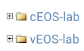

# Getting cEOS Installed

The labs involve the use of Arista's cEOS (container EOS) software. This is a lab environment version of the operating system that can be quite helpful for working in container environments such as what the labs are built on.

## Process

The process involves a few steps to being able to use the container image:

1. Downloading the image from Arista Networks
2. Importing the container image into Docker
3. Modifying the `lab.yml` file to represent the actual version

### Downloading the Image from Arista Networks

The first step is to have a copy of the image. With Arista making this generally available, please respect their property and follow the process to get the image.

If you do not have an account with Arista Networks software, register for an account through this process. This is a free process to accomplish and gets you access to the software. 

Follow the download link to [Arista Downloads](https://www.arista.com/en/support/software-download). Navigate down the page until you find a folder structure on the page:



Expand out the folder structure and select the top most image. Then follow the process to download the file.

### Importing the Container Image Into Docker

Once the image is downloaded, now you need to install the image into Docker. This can be done with the `docker import command`:

```bash
 ❯ docker import ~/Downloads/cEOS64-lab-4.29.5M.tar 
sha256:2b5e7c32d1458b3b772eb7e9129cead51a6f92aab038592da7b7e31ed5dc45b9
```

### Modifying the Lab File

Now that you have a cEOS image in your Docker environment, now update the `containerlab/lab.yml` file, line number 11 to match the version name downloaded. So in the example above with importing 4.29.5M you would change line 11 to look like:

```
      image: ceos:4.29.5M
```
