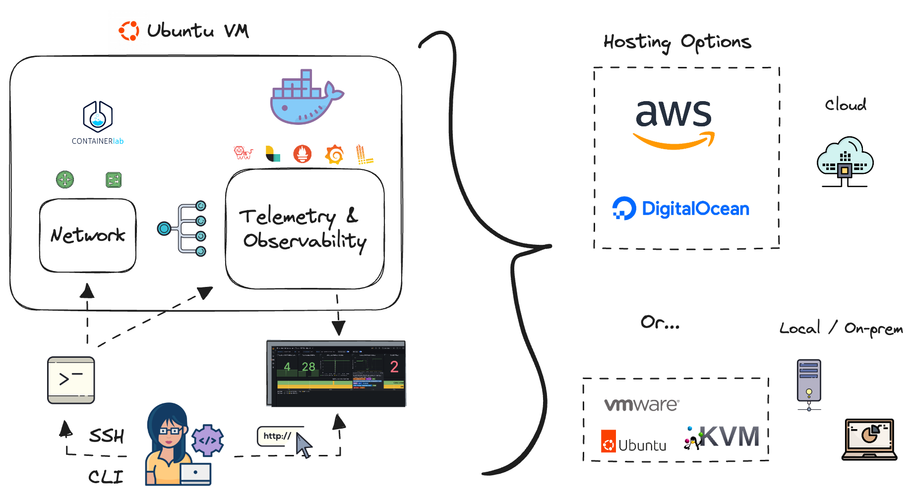

# Remote Machine Setup

This directory contains instructions for deploying a remote droplet (virtual machine) on DigitalOcean to follow along with the labs stored in this repository.

The virtual machine is configured to run the network observability lab using the `netobs` utility tool. If you are following along with the book, you can use this virtual machine to run the labs presented in the book.



- [Remote Machine Setup](#remote-machine-setup)
  - [Requirements](#requirements)
    - [1. Create a Digital Ocean account](#1-create-a-digital-ocean-account)
    - [2. Fork and Clone the Git Repository](#2-fork-and-clone-the-git-repository)
    - [3. Install the `netobs` tool](#3-install-the-netobs-tool)
    - [4. Setup environment files](#4-setup-environment-files)
    - [5. Download the Arista cEOS images](#5-download-the-arista-ceos-images)
    - [6. Create a Digital Ocean API token](#6-create-a-digital-ocean-api-token)
    - [7. Create an SSH key pair and retrieve its fingerprint](#7-create-an-ssh-key-pair-and-retrieve-its-fingerprint)
    - [8. Pointing to the Forked Repository for Installation](#8-pointing-to-the-forked-repository-for-installation)
    - [9. Create a Digital Ocean droplet](#9-create-a-digital-ocean-droplet)
  - [Interacting with the Lab Scenarios](#interacting-with-the-lab-scenarios)
    - [Connecting Visual Studio Code to Your DigitalOcean Droplet](#connecting-visual-studio-code-to-your-digitalocean-droplet)
    - [Note About the Lab Chapters](#note-about-the-lab-chapters)
  - [Removing the Lab Environment](#removing-the-lab-environment)

## Requirements

This guide uses DigitalOcean as the cloud provider, and it's important to note that charges may apply. The process employs the `netobs` utility to wrap Ansible playbooks for configuring the DigitalOcean droplet. A "control" machine, usually your local machine, is required to execute the commands and initiate the setup process.

### 1. Create a Digital Ocean account

Go to their website and create an account if you don't have one already. You can use this [link](https://www.digitalocean.com/try/free-trial-offer) for a free trial offer.

### 2. Fork and Clone the Git Repository

By forking this git repository, you are able to make the changes you desire and follow along with the examples and tasks presented in the book. To fork the repository, click the "Fork" button at the top right of [the repository page](https://github.com/network-observability/network-observability-lab) and follow the instructions. For more information on how to fork a GitHub repository see the [official documentation](https://docs.github.com/en/pull-requests/collaborating-with-pull-requests/working-with-forks/fork-a-repo).

After creating your fork, on your local or "control" machine clone your forked repository:

```bash
# On your local machine clone your forked repository and go to its root location
git clone https://github.com/<your-user>/network-observability-lab.git
cd network-observability-lab
```

### 3. Install the `netobs` tool

The `netobs` tool must be installed on your local or "control" machine. This tool is necessary to access data from the `network-observability-lab` repository and set up a ready-to-go environment.

To install the `netobs` tool on your local machine, follow these steps:

> **Note:** It is recommended to install `netobs` in a virtualized environment. Tools like [Pipenv](https://pipenv.pypa.io/en/latest/) can assist with this process.

```bash
# Install netobs
pip install .
```

### 4. Setup environment files

The setup of the lab environment relies on variables specified in the `.env` and `.setup.env` files. We provide skeleton files that you can reference to set up the environment. Begin by copying these example files:

```bash
# Copy the example setup environment file used to manage the DigitalOcean Droplet
cp example.setup.env .setup.env

# Copy the base example environment file used to manage the lab environment
cp example.env .env
```

- The `.env` file contains the necessary variables to manage the instances for each scenario in the lab environment. This includes credentials for connecting to network devices to even parameters for accessing Grafana.
- The `.setup.env` file holds the necessary variables to manage the creation, provisioning, and deletion of the DigitalOcean droplet. This file is only needed if you are using DigitalOcean to set up the lab environment.

Next, we will go over the steps to populate some of these variables to set up the lab environment.

### 5. Download the Arista cEOS images (optional)

> This is required when the scenario uses Arista cEOS

The lab environment uses Arista cEOS container images. You need to register and download these images from the Arista website. Once registered, use this [link](https://www.arista.com/en/support/software-download) to search and download the images under "cEOS-lab" > "EOS-<version>" > "cEOS64-lab-<version>.tar.xz".

Save the location of the downloaded file to `CEOS_IMAGE_PATH` under the `.setup.env` file. This will be used by Ansible to upload the image to your droplet.

### 6. Create a Digital Ocean API token

You need to create a Personal Access Token (PAT) for DigitalOcean. Follow the instructions in this [guide](https://docs.digitalocean.com/reference/api/create-personal-access-token/) to generate a PAT. Once you have created the PAT, save it in the `DO_API_TOKEN` environment variable in your `.setup.env` file.

### 7. Create an SSH key pair and retrieve its fingerprint

For information on how to create SSH keys, check out the [official documentation](https://docs.digitalocean.com/products/droplets/how-to/add-ssh-keys/). This step ensures secure and passwordless access to your droplet. For example on your local machine, you can use the following command to create an SSH key pair:

```bash
ssh-keygen -t rsa -b 4096 -C "network-observability-lab" -f ~/.ssh/id_rsa_do
```

This will create an SSH key pair in the `~/.ssh` folder with the name `id_rsa_do` and `id_rsa_do.pub` as the public key. After it is created you can copy and upload the public key over to your DigitalOcean account.

Next, go to your DigitalOcean account control panel and click the "Settings" menu and then "Security". Then click "Add SSH Key" and paste the content of the public key file. The name field is optional, but you can use `network-observability-lab` as the name. Then click "Add SSH Key".

Next, copy the fingerprint value of your SSH key and save it in the `DO_SSH_FINGERPRINT` environment variable in the `.setup.env` file.

If you followed the previous command or specified a custom name for your SSH private key file, copy its location and save it under the `SSH_KEY_PATH` variable in the `.setup.env` file. For example:

```bash
SSH_KEY_PATH="~/.ssh/id_rsa_do"
```

This step ensures that your SSH key is included in the DigitalOcean droplet build process, granting you access after the droplet is created.

### 8. Pointing to the Forked Repository for Installation

You need to configure the setup process to install your forked repository when creating and provisioning the DigitalOcean droplet. To do this, set the following environment variable in your `.setup.env` file:

```bash
NETOBS_REPO="https://github.com/<your-username>/network-observability-lab.git"
```

Additionally, you can specify a particular branch to be installed by setting the `NETOBS_BRANCH` variable. By default is going to use the `main` branch.

### 9. Create a Digital Ocean droplet

You're now ready to begin setting up the DigitalOcean droplet. Use the command `netobs setup deploy` to start the process. This script will initiate an Ansible playbook that will prompt you to specify the characteristics of your droplet, such as its size, region, and other details. Follow the prompts similar to those shown in the figure below, and the provisioning will commence, setting up the environment automatically.

On your local or "control" machine run the command to set the droplet up:

```bash
# Go to your forked repository and check netobs command capabilities
netobs --help

# Deploy DigitalOcean Droplet
netobs setup deploy
```

Or, if you want to deploy a concrete scenario (from chapters folder) and the topology, you can specify it:

```bash
netobs setup deploy --scenario webinar --topology ./chapters/webinar/containerlab/lab.yml --vars-topology ./chapters/webinar/containerlab/lab_vars.yml
```

The setup playbook will ask for the droplet image, its size and region to be deployed. It comes with default values, but you can change them if you prefer a bigger droplet size or region, for more information see [here](https://slugs.do-api.dev/).

> **IMPORTANT:** If you encounter issues, such as when trying to install packages on the droplet, you may see messages like the following:
> ```shell
> E: Could not get lock /var/lib/dpkg/lock-frontend. It is held by process 1555 (apt-get)
> E: Unable to acquire the dpkg frontend lock (/var/lib/dpkg/lock-frontend), is another process using it?
> ```
> In such cases, simply run the command again. The playbooks executed by `netobs setup deploy` are designed to be idempotent, meaning you can rerun the command without causing any adverse effects. This is particularly useful if you encounter issues like DigitalOcean API problems. Just make sure to use the same variables as initially prompted.

Once the setup completes, use the `netobs setup show` command to display an SSH command that will allow you to quickly access your droplet.

```bash
# Check droplet SSH command and IP address
netobs setup show
```

At this point, the droplet is fully set up with Docker, Containerlab, and the netobs tool installed. Additionally, your forked repository is cloned and ready to use. By default, the `batteries-included` scenario is running, and Nautobot is configured. Now, let's explore the various ways you can interact with your lab scenarios.

## Interacting with the Lab Scenarios

Now, you can start exploring and interacting with your lab environment. It includes various network devices and observability stack components, each of which is accessible and manageable. For network devices, you can use SSH or other network management protocols to connect to them. This allows you to modify configurations, run diagnostic commands, and test different network setups.

Here's an example of how to connect to an Arista cEOS network device using SSH. First, connect to the DigitalOcean droplet:

```bash
# Use the command output from the `netobs setup show` command from before
ssh -o StrictHostKeyChecking=no -i ~/.ssh/id_rsa_do root@<droplet-ip-address>
```

Then connect to a device, for example, `ceos-01`:

```bash
# Connect to ceos-01 via Cli utility command
docker exec -it ceos-01 Cli


# OR via SSH (using the default username and password). You can find the username and password in the .env file.
ssh netobs@ceos-01
```

Regarding the observability stack components like Telegraf, Prometheus, Grafana, and others, you can interact with them primarily through their web interfaces, APIs, or command-line interfaces (if available). For example, to access the Prometheus web interface, open a web browser and navigate to the IP address of your droplet and the port on which your Prometheus service is running (`http://<droplet-ip-address>:9090`). You can then write queries such as `interface_admin_status` in the query panel.


Alternatively, you can connect to your Grafana instance by navigating to `http://<droplet-ip-address>:3000`. Use the credentials provided in the `.env` file to log in. Once logged in, go to "Dashboards" > "Device Health" to access a comprehensive dashboard that monitors your devices:


During your interaction with the environment, you might change configurations, experiment with different metrics, create alerts or visualizations, or simulate various network conditions to see how the observability stack responds.

### Connecting Visual Studio Code to Your DigitalOcean Droplet

If you use [Visual Studio Code](https://code.visualstudio.com/) (VSCode), you can connect to your DigitalOcean droplet over SSH, allowing you to modify the lab environment directly. This setup is particularly useful if you're following along with the chapters of the book, as it enables you to configure, save, and run commands directly from the VSCode application.

1. **Open Visual Studio Code**: Launch VSCode on your local machine.
2. **Navigate to the Remote Explorer**: On the left sidebar, click on the "Remote Explorer" tab. Under "SSH," click the "+" sign or right-click and select "New Remote."
3. **Set Up SSH Connection**: This action will prompt you to enter the SSH connection command. You can obtain this command by running `netobs setup show` on your local or "control" machine. The output will resemble the following command:

   ```bash
   ssh -o StrictHostKeyChecking=no -i ~/.ssh/id_rsa_do root@<droplet-ip-address>
   ```

   Copy and paste this command into VSCode's prompt.

4. **Save the SSH Configuration**: Follow the prompts to save this new remote connection to your SSH configuration. Once connected, go to "Explorer" > "Open Folder," and navigate to your forked repository folder (`/root/network-observability-lab/`).

5. **Access Your Workspace**: You are now connected to your droplet and within your forked repository. Open the "Terminal" tab in VSCode and check the status of the `batteries-included` scenario by running the following command:

   ```bash
   netobs docker ps
   ```

This setup provides a dedicated workspace where you can freely change, add, or delete configurations and components to test different scenarios.

For more detailed information on connecting remotely using VSCode, refer to the [official VSCode documentation](https://code.visualstudio.com/docs/remote/ssh).

### Note About the Lab Chapters

The book is designed to guide you through a series of configuration tasks relevant to each chapter. Most chapters include their own scenario setup, along with a completed version of the configuration. For example, in Chapter 5, you might find Logstash and Telegraf configuration files that are intentionally left blank. It's your task to configure them as part of the chapter's exercises. The completed version of Chapter 5 includes all necessary configurations for the lab.

It's important to note that even if you set up a lab environment for a specific chapter using the command `netobs lab prepare --scenario ch5`, components like Telegraf or Logstash may not be fully operational due to the incomplete configuration files. By following the chapter's content and instructions, you will learn how to update these components and observe the impact on your observability stack.

## Removing the Lab Environment

Once you've finished experimenting and learning with your lab environment, you may want to tear it down, especially if you're using resources in a cloud environment where running costs are a consideration.

The process of tearing down your lab environment is referred to as 'destroying' the environment. It involves deleting all the components that were created, freeing up the resources they were using, and essentially returning your system to the state it was in before the environment was deployed.

To destroy a lab scenario **on the DigitalOcean droplet**, you can use the following commands:

```bash
# Remove the batteries-included scenario components
netobs lab destroy --scenario batteries-included

# Remove ALL scenarios setup (useful when you might not remember which one was up)
netobs lab purge
```

To remove the remote DigitalOcean droplet, you can run the command `netobs setup destroy` **on your local or "control" machine**. This will delete the droplet from your account, which is useful when you have finished the labs for the day.

```bash
# Delete the DigitalOcean Droplet
netobs setup destroy
```
